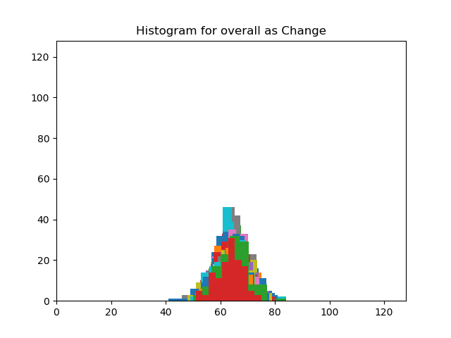
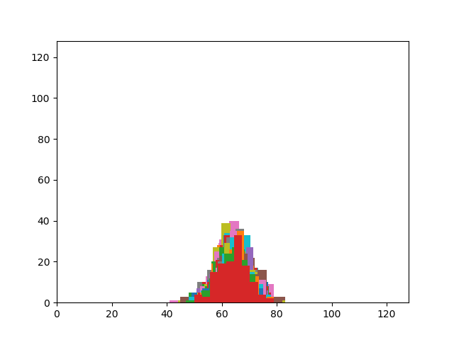

# AES Analysis

This project is intended to analyze the AES encryption algorithm. Specifically, a novel-o-classic method will be implemented to analyze the relation between the "key" and "plain text" to that of "encrypted sequence".

## Description 1

### TODO->Done:

Following sees the block analysis operation.

```
-> choose a plain text 128-byte long, P
-> take a random key 128-byte long, k
-> encrypt the plain text with key, E
-> for each bit in key, k:
	-> flip the bit to generate, k'
	-> encrypt plain text with key, k' to give E'
	-> find hamming distance between E and E'
-> create a histogram of the hamming distance measured
```

The pseudo code above was slightly modified so that we have "single position" change to "65 positions" change in the original key, **k** to produce **k'**. This change variable, **ch** has set bit position which indicate the bit in **k** to be changed. To produce a large number of changed keys, we circular shift (1 position to left to 127 position to left) **ch**.  XOR operation of **k**  and **ch** would produce **k'**

The whole idea was to find the change in the AES cipher when the key is changed by certain number of bits. We used ECB mode of AES cipher because we are concerned with only a block operation rather than on dependency of a complete sequence. Our analysis is based on a single 128-bit block of plain text. The source file is [here](sources/main_1.py).

Analysis was done calculating histogram of hamming distance between the cipher generated using original key and cipher generated using changed key. The output diagram would have made a huge impact if the histogram was placed at different locations for different number of bits changed. In hindsight, this would have made cracking of password easier.

**BUT,** the histogram are all placed at same position. This would mean that change of bits in key would produce random sequence of cipher. Following image shows the final image obtained. 



## Description 2

The above experiment does not indicate there is relation between the number of bits that are different in key vs the generated cipher.

So, we want to move on to do another experiment where we will read a file (a simple image file), and encrypt the file using AES-CBC (128) mode.

## Description 3

In this experiment, the encryption is performed in the same input data. However, key is varied for decryption operation and the difference in the obtained plain text` is performed.

Following is the image obtained.



Again, we can see the histogram is normally distributed. This means change in number of bits in key does not indicate closeness to the encrypted plain text.

