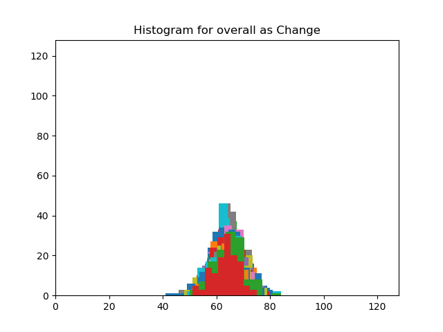

# AES Analysis

This project is intended to analyze the AES encryption algorithm. Specifically, a novel-o-classic method will be implemented to analyze the relation between the "key" and "plain text" to that of "encrypted sequence".

## Description 1

### TODO->Done:

Following sees the block analysis operation.

```
-> choose a plain text 128-byte long, P
-> take a random key 128-byte long, k
-> encrypt the plain text with key, E
-> for each bit in key, k:
	-> flip the bit to generate, k'
	-> encrypt plain text with key, k' to give E'
	-> find hamming distance between E and E'
-> create a histogram of the hamming distance measured
```

The pseudo code above was slightly modified so that we have 1 position variation to 65 position variation. The key is XORred with the circular shifted version of a number that gives the position of key to be flipped.

The whole idea was to find the change in the AES cipher when the key is changed by certain position of bits. We used ECB mode of AES cipher because we can concerned with only a block operation rather than on dependency of a complete sequence. In addition, we performed our analysis only on one 128-bit block, so anyways we did not have large data to use other modes than ECB.

Analysis was done calculating histogram of hamming distance between the cipher generated using original key and cipher generated using changed key. The output diagram would have made a huge impact if the histogram was placed at different locations for different number of bits changed. In hindsight, this would have made cracking of password easier.

**BUT,** the histogram are all placed at same position. This would mean that change of bits in key would produce random sequence of cipher. Following image shows the final image obtained. 



